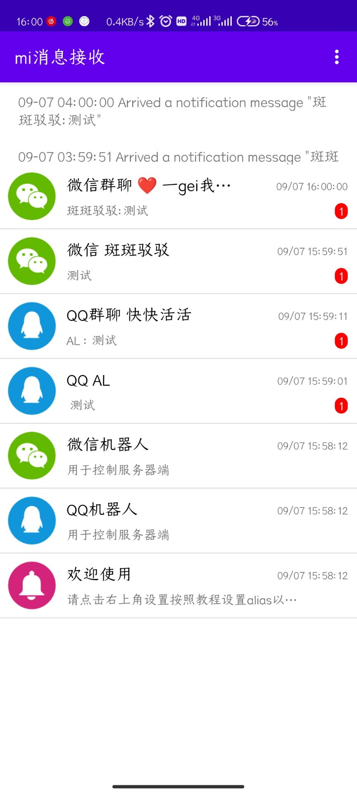
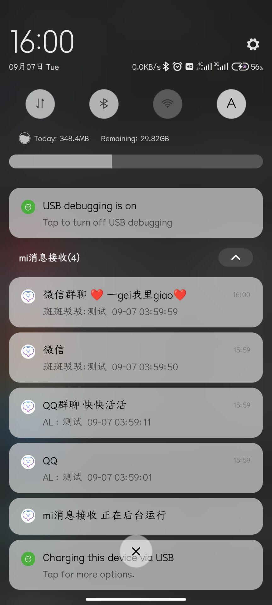
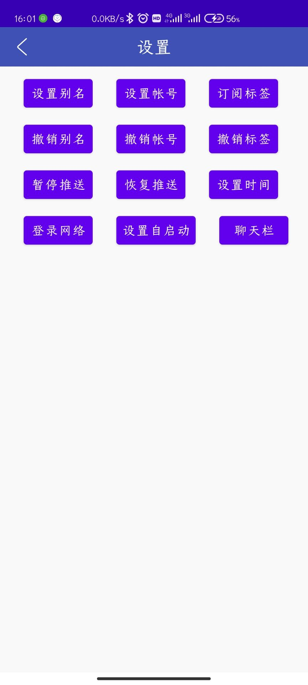
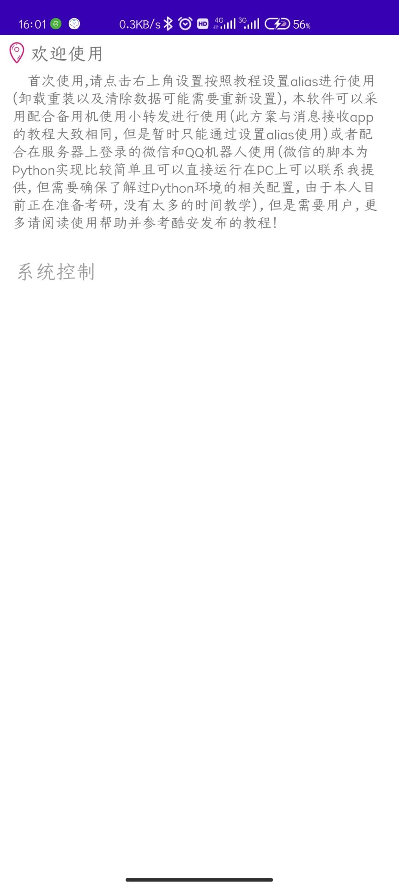

# Message-Receiver
本应用使用小米推送通道（MiPush，之后有时间会添加其他手机厂商的推送通道）不需要后台也可接收应用消息，可以配合小转发app转发通知备用机消息通知或者配合python微信脚本和qq机器人接收微信和QQ通知。

使用方法：

POST数据到：http://82.156.79.159:7964

title=标题

content=内容

alias=别名（别名需要在软件右上方设置中设置，尽量设置复杂些，以免与其他用户重复）

注：软件结合了小米push Demo以及GCMFormojo的部分布局代码以及许多本人自己使用的小功能，因此很多功能尚未实现或无法满足使用条件，请忽略无用功能。

教程：

配合小转发转发消息教程：

具体可以参考消息接收app的使用教程，具体大致可以为在主力机上首先设置别名alias，在备用机上安装小转发app设置

url：http://82.156.79.159:7964

title=%TITLE

content=%CONTENT

alias=你设置的alias，

之后设置转发需要转发的应用的通知，即可使用。

配合微信脚本和qq机器人接收消息教程：

微信脚本为python脚本，之后将会发布，也可以联系我获取，配置好相应的python环境运行登录即可。

QQ机器人配置比较复杂（我当初配置了大半天），可以在github上自行学习如何配置nonebot+go-cqhttp，之后只需修改几行代码即可，到时可以联系我获取要替换的文件。代码以及许多本人自己使用的小功能，因此很多功能尚未实现或无法满足使用条件，请忽略无用功能。

效果展示：

